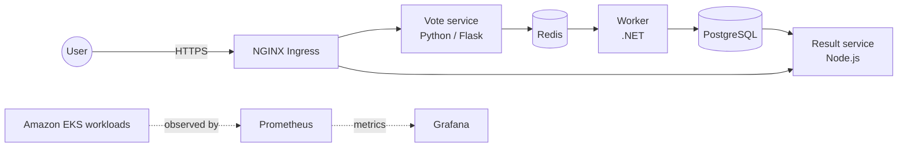

# AWS EKS Voting Application

A multi-service voting platform deployed on **Amazon EKS**, with AWS infrastructure managed through **Terraform**, workloads orchestrated by **Kubernetes**, automated deployment through **GitHub Actions**, and cluster monitoring with **Prometheus and Grafana**.

This project was completed during the Ironhack DevOps bootcamp to put cloud infrastructure, container orchestration, networking, CI/CD, observability, and troubleshooting into practice.

## Project highlights

- Deployed a distributed application composed of Python, .NET, Node.js, Redis, and PostgreSQL services.
- Provisioned the supporting AWS network and compute foundation with Terraform.
- Used an encrypted S3 backend and DynamoDB locking for remote Terraform state.
- Containerized the application and deployed it to Amazon EKS using Kubernetes manifests.
- Exposed the application through NGINX Ingress with DNS and TLS termination.
- Automated Kubernetes deployments from the `main` branch with GitHub Actions.
- Added CPU and memory requests and limits to application workloads.
- Monitored cluster, pod, node, disk, memory, and network health with Prometheus, Grafana, and Node Exporter.
- Load-tested the voting endpoint with up to 10,000 requests to observe application and infrastructure behaviour.

## Architecture

The application uses an asynchronous workflow:

1. Users submit a vote through the Python/Flask frontend.
2. The vote service places the vote in Redis.
3. The .NET worker consumes queued votes and writes them to PostgreSQL.
4. The Node.js result service reads the stored data and displays the results.
5. NGINX Ingress routes external HTTPS traffic to the vote and result services.
6. Prometheus collects infrastructure and Kubernetes metrics, which are visualized in Grafana.



> The repository contains the Terraform configuration for the supporting AWS network/EC2/ALB environment and the Kubernetes manifests used to deploy the application to an existing EKS cluster.

## Technology stack

| Area | Technologies |
| --- | --- |
| Cloud | AWS, Amazon EKS, EC2, VPC, ALB, S3, DynamoDB |
| Infrastructure as Code | Terraform |
| Containers | Docker, Docker Compose |
| Orchestration | Kubernetes, NGINX Ingress |
| Application | Python/Flask, .NET, Node.js/Express |
| Data | Redis, PostgreSQL |
| CI/CD | GitHub Actions |
| DNS and TLS | Route 53, cert-manager, Let's Encrypt |
| Observability | Prometheus, Grafana, Node Exporter |
| Configuration | Ansible |

## Repository structure

```text
.
├── .github/workflows/       # GitHub Actions deployment workflow
├── ansible/                 # Host configuration and Docker Compose files
├── bootstrap/               # S3 state bucket and DynamoDB lock table
├── infrastructure/          # Terraform for AWS networking and compute
├── k8s/                     # Kubernetes Deployments, Services, and Ingress
├── scripts/                 # Load-testing scripts
├── vote/                    # Python voting frontend
├── worker/                  # .NET background worker
├── result/                  # Node.js results application
├── cluster-issuer.yaml      # Let's Encrypt ClusterIssuer
└── docker-compose.yaml      # Local multi-container environment
```

## Kubernetes deployment

The Kubernetes configuration defines:

- Two replicas of the vote service.
- Two replicas of the result service.
- Two replicas of the worker service.
- Redis and PostgreSQL internal services.
- `ClusterIP` services for private service-to-service communication.
- CPU and memory requests and limits for the vote and result workloads.
- NGINX Ingress routing for `/` and `/result`.
- HTTPS certificates issued by cert-manager through Let's Encrypt.

Kubernetes' internal DNS allows services to communicate using names such as `redis-service` and `postgres`, without hard-coded pod IP addresses.

## Infrastructure as Code

Terraform is split into two stages:

### 1. Remote-state bootstrap

The `bootstrap/` configuration creates:

- An encrypted and versioned S3 bucket for Terraform state.
- A DynamoDB table for state locking.

### 2. AWS infrastructure

The `infrastructure/` configuration creates:

- A custom VPC.
- Public and private subnets across two Availability Zones.
- An Internet Gateway and NAT Gateway.
- Public and private route tables.
- Security groups with role-specific rules.
- EC2 instances and an Application Load Balancer used during the infrastructure phase of the project.
- A generated Ansible inventory.

## CI/CD

The GitHub Actions workflow runs whenever code is pushed to `main`. It:

1. Checks out the repository.
2. Authenticates to AWS using repository secrets.
3. Updates the kubeconfig for the EKS cluster.
4. Applies the Kubernetes manifests.
5. Displays the deployed pods, services, and ingress resources for verification.

The workflow expects these GitHub Actions secrets:

```text
AWS_ACCESS_KEY_ID
AWS_SECRET_ACCESS_KEY
AWS_REGION
```

For a production implementation, GitHub OpenID Connect and a short-lived IAM role would be preferable to long-lived access keys.

## Observability

Prometheus and Grafana were used to monitor both Kubernetes and the underlying nodes. The dashboards provided visibility into:

- Node and cluster CPU utilization.
- Memory usage and pressure.
- Filesystem capacity and disk activity.
- Network traffic.
- Pod and container status.
- Workload resource usage.
- Kubernetes cluster health.

This helped move troubleshooting beyond simply checking whether the website was reachable. I could inspect resource pressure, identify unhealthy workloads, and understand how the platform responded during load testing.

### Dashboard screenshots

To display the screenshots in this README, add them to `docs/images/` using the following names:

```text
docs/images/architecture.png
docs/images/kubernetes-overview.png
docs/images/node-exporter.png
docs/images/kubernetes-cluster.png
docs/images/kubernetes-pods.png
```

Then uncomment the image links below:

<!--


-->

## Run locally with Docker Compose

### Prerequisites

- Docker
- Docker Compose

Clone the repository and start the application:

```bash
git clone https://github.com/leorfy15/ironhack-project-1c.git
cd ironhack-project-1c
docker compose up -d
```

Open:

- Voting interface: <http://localhost:8080>
- Results interface: <http://localhost:8081>

Check the containers:

```bash
docker compose ps
```

Stop the environment:

```bash
docker compose down
```

## Deploy the Kubernetes workloads

### Prerequisites

- An accessible Kubernetes or EKS cluster.
- `kubectl` configured for that cluster.
- NGINX Ingress Controller.
- cert-manager if TLS is enabled.
- Application images available to the cluster.

Apply the application manifests:

```bash
kubectl apply -f k8s/
```

If cert-manager is installed, apply the cluster issuer:

```bash
kubectl apply -f cluster-issuer.yaml
```

Verify the deployment:

```bash
kubectl get pods
kubectl get services
kubectl get ingress
kubectl get events --sort-by=.metadata.creationTimestamp
```

> Before deploying to a different environment, update the hostname in `k8s/ingress.yaml` and confirm that DNS points to the ingress load balancer.

## Load testing

The repository contains scripts that generate concurrent votes against the configured HTTPS endpoint:

```bash
./scripts/load-test-votes.sh
```

The configurable HPA test accepts the number of requests, concurrency, and vote option:

```bash
./scripts/hpa-load-test.sh 10000 200 a
```

The tests were used alongside Grafana to observe how CPU, memory, pods, and nodes behaved under increased demand.

## Key lessons

- A successful deployment is only the beginning; observability is essential for understanding system behaviour.
- Resource requests are required for CPU-based Horizontal Pod Autoscaling to make reliable scaling decisions.
- Separating public and private network tiers reduces unnecessary exposure.
- Remote Terraform state and locking are important when infrastructure is managed collaboratively.
- Kubernetes service discovery removes the need to manage changing pod IP addresses.
- Load testing reveals resource constraints that are easy to miss during normal manual testing.

## Security and production improvements

This is a learning project. Before production use, I would:

- Replace the PostgreSQL credentials in the manifests with Kubernetes Secrets or an external secret manager.
- Add persistent storage for PostgreSQL.
- Use GitHub OIDC with a least-privilege IAM role.
- Pin application images to immutable tags or digests instead of `latest`.
- Add readiness and liveness probes to every workload.
- Add NetworkPolicies and restrict public ingress where possible.
- Manage the EKS cluster, monitoring stack, DNS, and ingress components as version-controlled Infrastructure as Code.
- Add automated build, security scanning, tests, and rollout verification to the CI/CD pipeline.

## Author

**Tatiana Tudor**  
DevOps Engineer | Cloud Infrastructure | Kubernetes | Terraform | Observability

## Acknowledgements

The application is based on the Docker Example Voting App and was extended as an Ironhack DevOps project with AWS infrastructure, Kubernetes deployment, CI/CD, TLS, load testing, and observability.

## License

See [LICENSE](LICENSE).
